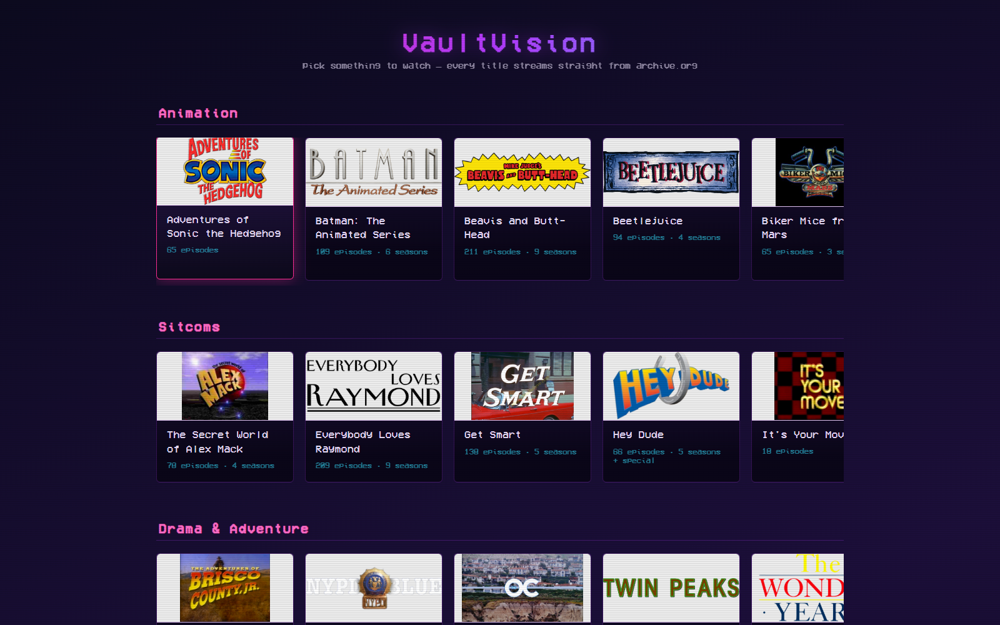
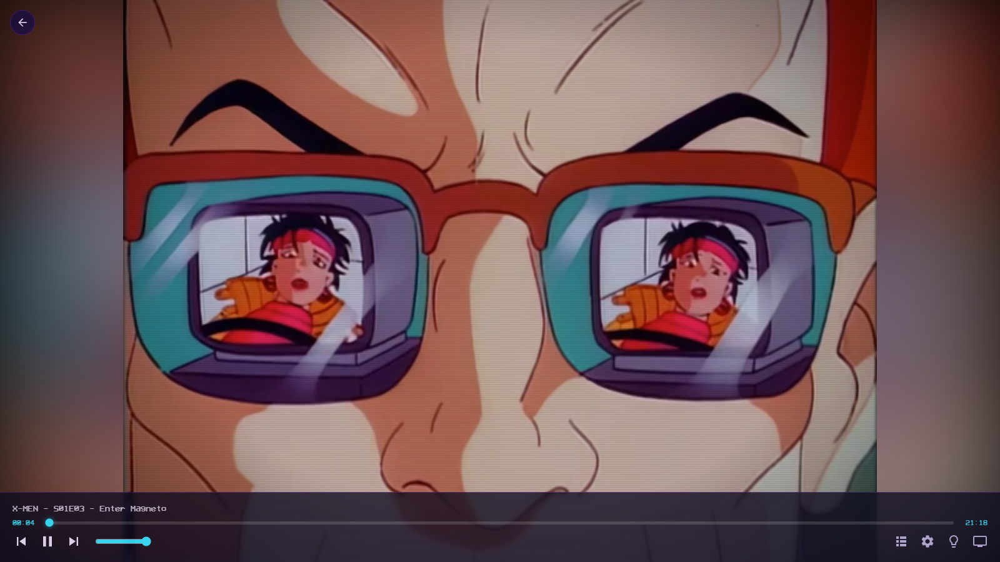
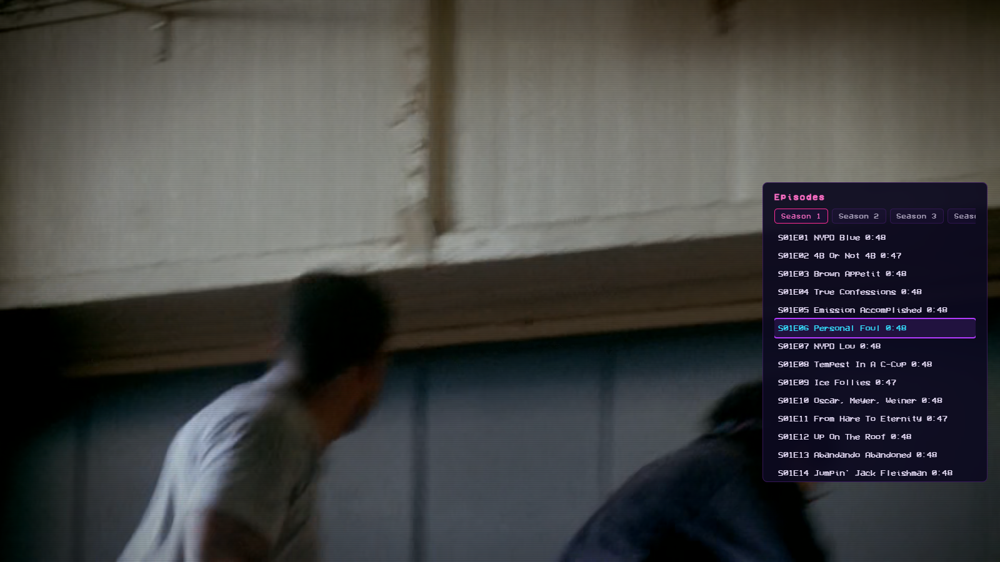
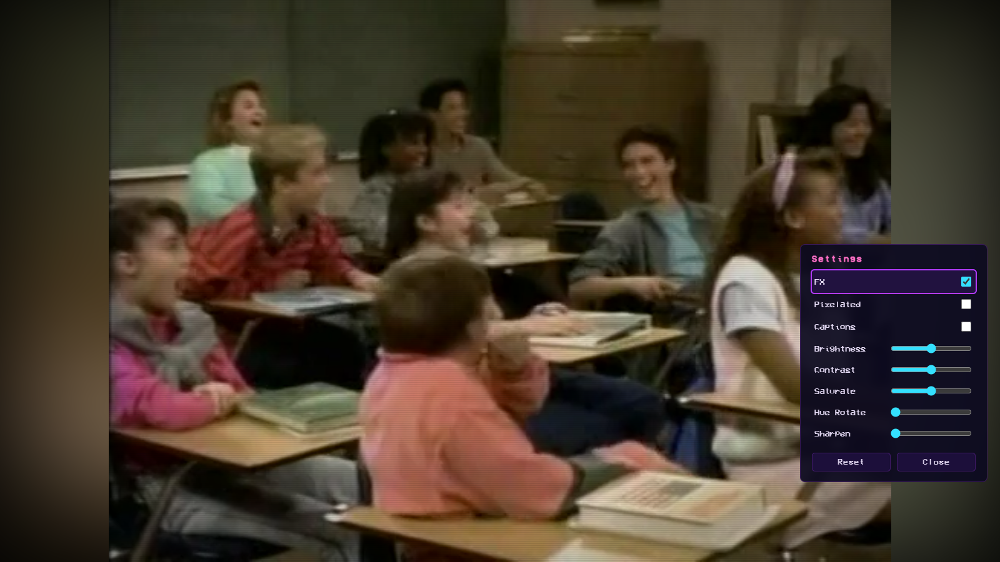
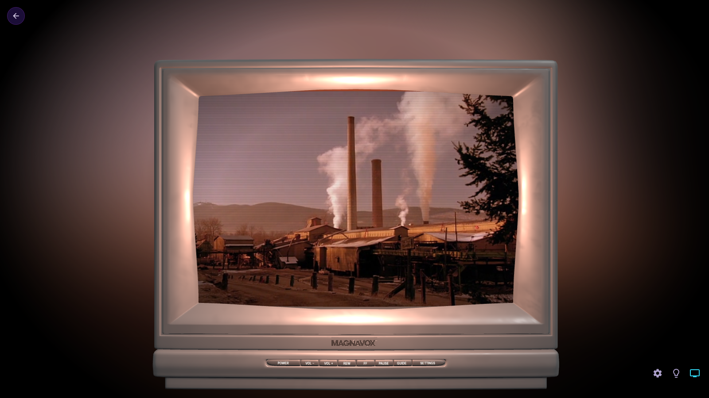

# VaultVision

**Live demo:** https://chairpants.github.io/VaultVision/

Browse a channel guide of classic shows and play them edge-to-edge straight from
[archive.org](https://archive.org) — on-screen display, episode guide, captions,
and a toggle into the three.js **3D Magnavox CRT** mode. Hosts no video itself.

## Screenshots

**Guide** — genre rows, poster cards, a neon synthwave palette:



**Flat 2D player** — edge-to-edge video with its own HUD (scrubber, transport,
volume, settings/episodes/lights buttons), fading out when idle:



**Episode list** — season tabs, current-episode highlight, same neon palette as
the guide, overlaid on the still-playing video:



**Settings panel** — brightness/contrast/saturate/hue/sharpen live over the video:



**3D CRT mode** — the video textured onto a Magnavox model: barrel-distorted
glass, ambilight glow bleeding onto the bezel, a real labeled control strip
(POWER/VOL/REW/FF/PAUSE/GUIDE/SETTINGS):



## Running it

It's plain static HTML/CSS/JS — no build step. Serve the folder with anything:

```
python3 -m http.server 8080
```

then open `http://localhost:8080`.

## Controls

| Key | Action |
|---|---|
| Arrow keys | move the focus ring across the guide / navigate menus |
| Enter | open the focused show / activate |
| Esc | back / close |

In the player: `g` guide · `s` settings · `d` 3D toggle · `c` captions, plus the
usual play/pause, seek, and volume keys. (These double as D-pad/remote-style
input, so the same code works unmodified on TV-shaped browsers.)

## Layout

```
index.html            channel guide, sorted by genre + a Resume row (+ arrow-key focus via tv.js)
show.html              per-show info screen: art/title, resume-or-play, episode list w/ season tabs
tv.js                 guide keyboard/D-pad navigation (row/carousel aware)
engine/
  viewer.html         flat/3D player — flat mode has its own HUD (scrubber, transport, volume,
                      settings + episode-list panels); 3D mode keeps the original canvas OSD
  magnavox.glb.js     the 3D CRT model (~20 MB, only fetched in 3D mode)
shows/                per-show episode data + captions
art/                  poster art
```

`shows/` (per-show episode data) and `art/` (posters) are bundled in the repo, so
it's self-contained — clone and serve, no other dependencies.

## Caveats

- **CDN dependencies.** three.js and the VCR font load from CDNs, and video comes
  from archive.org.
- **Ambilight = a 2nd `<video>`.** Some devices have a single hardware video
  decoder; the blurred ambilight twin may not play everywhere.
